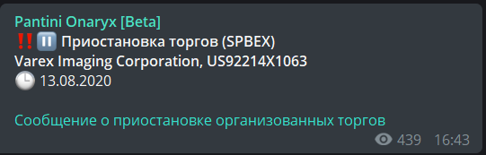

# Onaryx

[https://t.me/onaryx](https://t.me/onaryx)


В настоящее время оповещения о приостановке торгов на бирже СПб не работают[.](https://t.me/pantini_rats)


Канал сообщает о торговых паузах на бирже СПб за три минуты до остановки. Чтобы узнать время возобновления торгов, следует перейти по ссылке в сообщении с подробностями.

Дополнительно сообщается о паузах на стороне бирж NYSE и NASDAQ. Если на зарубежных площадках происходит приостановка торгов, биржа СПб может также остановить торги.

Информация отслеживается с ресурса **NasdaqTrader**:



### Приостановка торгов - теория

Существует много различных причин, по которым могут приостановить торги акциями в США. К нашему счастью, эти причины документированы, но для начала узнаем, где смотреть информацию о приостановке торгов.

Список тикеров, по которым торги приостановлены, можно отслеживать в реальном времени здесь \(страница обновляется сама\): [https://www.nasdaqtrader.com/trader.aspx?id=TradeHalts](https://www.nasdaqtrader.com/trader.aspx?id=TradeHalts)

Также по ссылке доступна 21-дневная история приостановок.

Еще можно смотреть тут: [https://markets.cboe.com/us/equities/market\_statistics/halts/](https://markets.cboe.com/us/equities/market_statistics/halts/)

Для бумаг с OTC \(over the counter - внебиржевые торги\) список \(и историю за 6 месяцев\) можно найти тут: [https://otce.finra.org/otce/tradingHalts](https://otce.finra.org/otce/tradingHalts)

В соответствии с требованиями FINRA, если на головной площадке торги остановились, все рыночные центры ликвидности должны приостановить торги. Например, если остановились торги по акции **BA**, которая листингована на NYSE, то торги остановятся и на NASDAQ, и на BATS, и в даркпулах.

В таблице по ссылке \(с nasdaqtrader.com\) несколько колонок: 

* **Halt Date** - дата приостановки торгов в формате месяц/день/год
* **Halt Time** - время приостановки торгов, Eastern Time \(Североамериканское восточное время\)
* **Issue Symbol** - тикер ценной бумаги, по которой приостановили торги Market - NASDAQ, NYSE, AMEX - в зависимости от того, где листингована бумага
* **Reason Codes** - коды причин приостановки
* **Pause Threshold Price** - пороговая индикативная цена, заполняется в случае торговой паузы \(trading pause\)
* **Resumption Date** - дата возобновления торгов
* **Resumption Quote Time** - время возобновления котирования \(публикации книги ордеров и приёма заявок\)
* **Resumption Trade Time** - время возобновления торгов \(можно покупать/продавать, идут принты в ленту сделок\)      

Если колонка не заполнена, значит, данные появятся позднее \(как только станут известны\). **Pause Threshold Price** заполняется только для торговых пауз \(trading pause\).

Для бумаг, листингованных на NASDAQ, время возобновления котирования и торгов отличаются на 5 минут, в течение которых участники торгов могут вводить свои заявки в систему. Далее запускается перекрёстная сессия \(The NASDAQ Halt Cross\), и торги возобновляются.

### Коды торговых пауз \(NYSE/NASDAQ\)

Коды причин \(столбик **Reason Code** из таблицы\): 

* **T1: Halt - News Pending.** Приостановка торгов связана с выходящей новостью. Корпоративная этика и регуляция SEC \(Regulation FD - "Fair Disclosure", регламент о добросовестном раскрытии информации\) предполагает публикацию важных новостей в часы, когда рынок не работает \(можно публиковать новости на премаркете или постмаркете\). Если новость необходимо выпустить в основную торговую сессию, торги приостанавливаются
* **T2: Halt - News Released.** Новости вышли, компания выполняет требования о добросовестном раскрытии информации \(Regulation FD\) через методики, рекомендуемые SEC \(Комиссия по ценным бумагам и биржам США\). Обычно это заполнение формы 8-K и публикация новости на своем \(принадлежащем компании\) сайте, аккаунтах в соц. сетях. Суть в том, что важная информация должна быть открыта в доступ для широкой аудитории \(для всех сразу\), чтобы у аналитиков, институциональных инвесторов и других заинтересованных лиц не было торговых преимуществ. Больше информации тут: [https://media2.mofo.com/documents/faqs-regulation-fd.pdf](https://media2.mofo.com/documents/faqs-regulation-fd.pdf) 
* **T5: Single Stock Trading Pause in Effect.** Цена бумаги изменилась более, чем на 10% \(включительно\) за 5 минут
* **T6: Halt - Extraordinary Market Activity.** Необычная рыночная активность. Срабатывает, если NASDAQ обнаруживает проблемы \(которые могут привести к изменению цены\) с котированием, репортингом в ленту или проблемы соединения. Пока технические проблемы будут устраняться, торги не проводятся
* **T8: Halt - Exchange-Traded-Fund \(ETF\).** Срабатывает в ETF, если обнаружены проблемы в базовых активах
* **T12: Halt - Additional Information Requested by NASDAQ.** Срабатывает, если NASDAQ ожидает дополнительную информацию о бумаге \(эмитенту направляются вопросы, на которые тот должен дать ответ\). Пример: [http://ir.nasdaq.com/static-files/01e4e9dd-a14a-4e5e-a1e6-799cc368b3de](http://ir.nasdaq.com/static-files/01e4e9dd-a14a-4e5e-a1e6-799cc368b3de) 
* **H4: Halt - Non-compliance**. Несоответствие требованиям листинга NASDAQ
* **H9: Halt - Not Current**. Компания не опубликовала актуальный отчёт в регулирующие органы \(SEC\)
* **H10: Halt - SEC Trading Suspension.** SEC приостановила торги \(что-то серьезное, торги приостанавливаются на неопределенное время\). [https://www.sec.gov/investor/alerts/tradingsuspensions.pdf](https://www.sec.gov/investor/alerts/tradingsuspensions.pdf) Приостановка торгов со стороны SEC возникает в следующих случаях: недостаточность или неточность информации о компании в SEC, просрочка регулярных отчётов; подозрения в недобросовестном раскрытии информации на сайте компании в пресс-релизах; подозрения в недобросовестных практиках инсайдерской торговли, манипуляции ценой и др.
* **H11: Halt - Regulatory Concern**. Торги приостановлены на другом рыночном центре по требованию регулирующих органов. Длительность приостановки может исчисляться днями или неделями
* **O1: Operations Halt, Contact Market Operations**. Проблемы с маркет-мейкингом \(проблемы с выставлением котировок и обработкой заявок участников торгов\)
* **IPO1: HIPO Issue not yet Trading**. Проблемы на торгах бумаг, выходящих на IPO \(в первый день торгов\). Торги IPO начинаются позже начала основной сессии на несколько часов
* **M1: Corporate Action**. Корпоративное событие
* **M2: Quotation Not Available**. Нет котировок по инструменту
* **LUDP: Volatility Trading Pause**. Это торговая пауза в связи с волатильностью. Срабатывает механизм предохранителя \(Circuit Breaker\), торги останавливаются \(только NASDAQ\)
* **LUDS: Volatility Trading Pause - Straddle Condition**. Пауза, связанная с выходом котировки bid или ask за установленные пределы
* **MWC1, MWC2, MWC3, MWC0**: Market Wide Circuit Breaker Halt. Остановка торгов из-за срабатывания глобального предохранителя
* **M: Volatility Trading Pause**. Пауза в связи с волатильностью. Ставится для бумаг, листингованных на NYSE/Nyse Arca. Для NASDAQ используется код **LUDP**
* **D: Security deletion from NASDAQ / CQS \(Consolidated Quotation System\)**. Инструмент изъят с торгов

Если стоит пробел, то причина недоступна.

### Коды причин после возобновления котирования

Как только основная проблема, вызвавшая остановку торгов, решена, и котирование \(и приём заявок участников торгов\) возобновляется, код причины меняется на другой \(и далее ожидается старт торгов\):

* **T3: News and Resumption Times**. См. код **T2**, теперь публикация новостей закончена
* **T7: Single Stock Trading Pause/Quotation-Only Period.** См. код **T5**
* **R4: Qualifications Issues Reviewed/Resolved; Quotations/Trading to Resume**. См. код **H4**
* **R9: Filing Requirements Satisfied/Resolved; Quotations/Trading To Resume.** См. код **H9**
* **C3: Issuer News Not Forthcoming; Quotations/Trading To Resume.** Публикация новостей отменена. См. коды **T2** и **T3**
* **C4: Qualifications Halt Ended; Maintenance Requirements Met.** См. коды **H4** и **R4**
* **C9: Qualifications Halt Concluded; Filings Met; Quotes/Trades To Resume.** См. коды **H9** и **R9**
* **C11: Trade Halt Concluded By Other Regulatory Auth.; Quotes/Trades Resume.** См. код **H11**
* **R1: New Issue Available.** См. код **T1**
* **R2: Issue Available.** См. код **T2**
* **IPOQ: IPO security released for quotation.** Для бумаг в день IPO - начало котирования. Только для бумаг с NASDAQ
* **IPOE: IPO security - positioning window extension.** Расширение периода подачи ордеров в перекрёстной сессии NASDAQ для бумаг в день IPO
* **MWCQ: Market Wide Circuit Breaker Resumption.** Снятие глобального предохранителя

Тройные цепочки **H-R-C** \(например, **H4**, **R4**, **C4**\) идут по следующему пути: сначала проблема фиксируется \(код **H**\), затем проблема рассматривается \(код **R**\), далее приостановка снимается, возобновляется котирование \(код **C**\).

